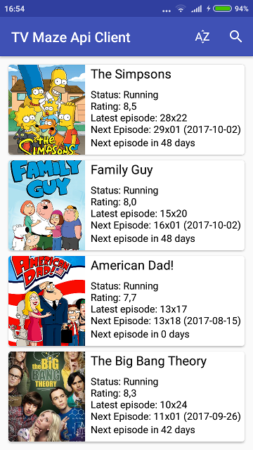

# TVMazeApiClient

A very simple app showing that I am somewhat capable of writing MVP, testable code. This is side project, very early stage of development. It is TV Maze client, it shows list of TV Shows and information. The API is public. http://www.tvmaze.com/api

It utilizes so far:
* simple MVP programming: done search component, details component, most main component
* fetches data using retrofit, rxjava
* uses DbFlow Database
* written kotlin
* some junit, mockito tests
* dbflow robolectric tests

Plans / In progress:
* simply finish app: i.e. notifications about new episodes, add to calendar
* reconsider database library
* consider CoordinatorLayout
* try espresso ui tests
* utilize more reactiveX
* add more fancy animations

